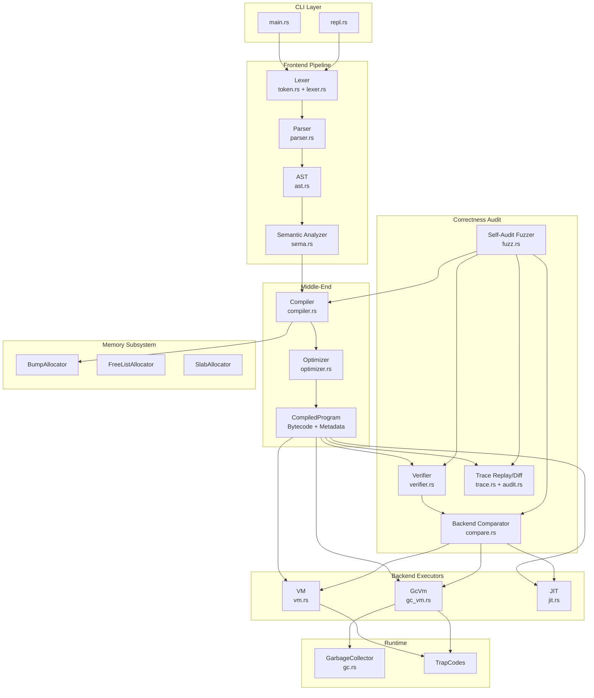

# MiniLang System Architecture

## 1. High-Level Architecture

### ASCII Diagram

```
┌─────────────────────────────────────────────────────────────────────────────┐
│                              CLI (main.rs)                                  │
│  --verify  --compare-backends  --trace-*  --fuzz  --jit  --gc  --repl      │
└─────────────────────────────────────────────────────────────────────────────┘
                                      │
                                      ▼
┌─────────────────────────────────────────────────────────────────────────────┐
│                           FRONTEND PIPELINE                                 │
│  ┌─────────┐    ┌─────────┐    ┌─────────┐    ┌──────────┐                 │
│  │  Lexer  │───▶│  Parser │───▶│   AST   │───▶│   Sema   │                 │
│  │         │    │         │    │         │    │ Analyzer │                 │
│  └─────────┘    └─────────┘    └─────────┘    └──────────┘                 │
│    token.rs      parser.rs       ast.rs         sema.rs                     │
└─────────────────────────────────────────────────────────────────────────────┘
                                      │
                                      ▼
┌─────────────────────────────────────────────────────────────────────────────┐
│                           MIDDLE-END                                        │
│  ┌──────────┐    ┌───────────┐                                             │
│  │ Compiler │───▶│ Optimizer │                                             │
│  │          │    │ (optional)│                                             │
│  └──────────┘    └───────────┘                                             │
│   compiler.rs     optimizer.rs                                              │
│        │                                                                    │
│        ▼                                                                    │
│  ┌──────────────────────┐                                                  │
│  │   CompiledProgram    │                                                  │
│  │  (Bytecode + Metadata)│                                                  │
│  └──────────────────────┘                                                  │
└─────────────────────────────────────────────────────────────────────────────┘
                                      │
                         ┌────────────┼────────────┐
                         ▼            ▼            ▼
┌─────────────────────────────────────────────────────────────────────────────┐
│                           BACKEND (choose one)                              │
│  ┌─────────┐       ┌─────────┐       ┌─────────┐                           │
│  │   VM    │       │  GcVm   │       │   JIT   │                           │
│  │(interp) │       │ (+ GC)  │       │ (x86-64)│                           │
│  └─────────┘       └─────────┘       └─────────┘                           │
│    vm.rs            gc_vm.rs          jit.rs                                │
└─────────────────────────────────────────────────────────────────────────────┘
                                      │
                         ┌────────────┴────────────┐
                         ▼                         ▼
┌────────────────────────────────┐  ┌────────────────────────────────────────┐
│        MEMORY SUBSYSTEM        │  │           RUNTIME SUPPORT              │
│  ┌──────┐ ┌──────┐ ┌───────┐  │  │  ┌──────┐  ┌───────┐  ┌─────────┐     │
│  │ Bump │ │ Free │ │ Slab  │  │  │  │  GC  │  │ Traps │  │ Cycles  │     │
│  │Alloc │ │ List │ │ Alloc │  │  │  │      │  │       │  │ Limits  │     │
│  └──────┘ └──────┘ └───────┘  │  │  └──────┘  └───────┘  └─────────┘     │
│          alloc.rs              │  │    gc.rs                               │
└────────────────────────────────┘  └────────────────────────────────────────┘
```

### Mermaid Diagram



---

## 2. Component-Level Diagram

```
┌─────────────────────────────────────────────────────────────────────────────┐
│                                MODULES                                      │
├─────────────────────────────────────────────────────────────────────────────┤
│                                                                             │
│  ┌─────────────┐      ┌─────────────┐      ┌─────────────┐                 │
│  │   token.rs  │      │  lexer.rs   │      │  parser.rs  │                 │
│  │             │◀────▶│             │◀────▶│             │                 │
│  │ Token       │      │ Lexer       │      │ Parser      │                 │
│  │ TokenKind   │      │ tokenize()  │      │ parse()     │                 │
│  │ Span        │      │             │      │             │                 │
│  └─────────────┘      └─────────────┘      └─────────────┘                 │
│         │                                         │                         │
│         │              ┌─────────────┐            │                         │
│         └─────────────▶│   ast.rs    │◀───────────┘                         │
│                        │             │                                      │
│                        │ Expr        │                                      │
│                        │ Stmt        │                                      │
│                        │ Program     │                                      │
│                        └─────────────┘                                      │
│                               │                                             │
│                               ▼                                             │
│                        ┌─────────────┐                                      │
│                        │   sema.rs   │                                      │
│                        │             │                                      │
│                        │ TypeCheck   │                                      │
│                        │ Scopes      │                                      │
│                        │ Errors      │                                      │
│                        └─────────────┘                                      │
│                               │                                             │
│                               ▼                                             │
│  ┌─────────────┐      ┌─────────────┐      ┌─────────────┐                 │
│  │ compiler.rs │─────▶│ optimizer.rs│─────▶│   vm.rs     │                 │
│  │             │      │             │      │             │                 │
│  │ Opcode      │      │ ConstFold   │      │ Vm          │                 │
│  │ Instruction │      │ DCE         │      │ VmResult    │                 │
│  │ Compile()   │      │ Peephole    │      │ TrapCode    │                 │
│  └─────────────┘      └─────────────┘      └─────────────┘                 │
│         │                                         │                         │
│         │              ┌─────────────┐            │                         │
│         └─────────────▶│  gc_vm.rs   │◀───────────┘                         │
│                        │             │                                      │
│                        │ GcVm        │                                      │
│                        │ GcValue     │                                      │
│                        │ HeapArray   │                                      │
│                        └─────────────┘                                      │
│                               │                                             │
│         ┌─────────────────────┼─────────────────────┐                       │
│         ▼                     ▼                     ▼                       │
│  ┌─────────────┐      ┌─────────────┐      ┌─────────────┐                 │
│  │  alloc.rs   │      │   gc.rs     │      │   jit.rs    │                 │
│  │             │      │             │      │             │                 │
│  │ Bump        │      │ GC          │      │ JitCompiler │                 │
│  │ FreeList    │      │ Mark-Sweep  │      │ MachineCode │                 │
│  │ Slab        │      │ Roots       │      │ x86-64      │                 │
│  └─────────────┘      └─────────────┘      └─────────────┘                 │
│                                                                             │
└─────────────────────────────────────────────────────────────────────────────┘

BOUNDARIES:
───────────
  Public API: lib.rs exports Lexer, Parser, Compiler, Vm, GcVm, JitCompiler
  Internal:   All other types are module-private
  FFI:        JIT uses libc (mmap, mprotect, munmap)
```

---

## 3. Component Responsibilities

| Component | Single-Sentence Responsibility |
|-----------|-------------------------------|
| `token.rs` | Defines token types and source location spans. |
| `lexer.rs` | Converts source text into a stream of tokens. |
| `ast.rs` | Defines the tree structure representing parsed programs. |
| `parser.rs` | Transforms token streams into AST via recursive descent. |
| `sema.rs` | Validates AST semantics (types, scopes, declarations). |
| `compiler.rs` | Lowers AST to stack-based bytecode with metadata. |
| `optimizer.rs` | Transforms bytecode to reduce instruction count. |
| `limits.rs` | Defines shared runtime and verifier ceilings. |
| `verifier.rs` | Checks bytecode structure, possible traps, and backend eligibility. |
| `compare.rs` | Compares observable behavior across executable backends. |
| `trace.rs` | Defines replay-oriented instruction events and divergence helpers. |
| `audit.rs` | Runs trace replay and VM-vs-GC trace diff reports. |
| `fuzz.rs` | Generates deterministic valid programs and runs the full audit pipeline. |
| `vm.rs` | Interprets bytecode using a software operand stack. |
| `gc_vm.rs` | Interprets bytecode with heap-allocated arrays and GC. |
| `jit.rs` | Compiles bytecode to x86-64 machine code at runtime. |
| `alloc.rs` | Provides arena/bump/slab memory allocators. |
| `gc.rs` | Implements mark-sweep garbage collection primitives. |
| `repl.rs` | Provides interactive read-eval-print loop. |
| `main.rs` | CLI entry point dispatching to appropriate pipeline. |

---

## 4. Core Abstractions

### 4.1 Token / TokenKind

**What:** Atomic unit of source text with type and location.

**Why:** Decouples lexical analysis from parsing; enables error reporting with source positions.

**Alternatives Rejected:**
- Direct character parsing: No error recovery, poor diagnostics
- String slices: Loses position information

### 4.2 Expr / Stmt / Program (AST)

**What:** Tree representation of program structure with Box<Expr> for recursion.

**Why:** Natural representation for recursive language constructs; enables pattern matching in compiler.

**Alternatives Rejected:**
- Arena-allocated AST (arena_ast.rs exists but unused): Would improve cache locality but adds lifetime complexity
- Flat instruction list: Loses structural information needed for semantic analysis

### 4.3 Opcode / Instruction / CompiledProgram

**What:** Stack-based bytecode IR with typed opcodes and two i32 arguments per instruction.

**Why:** Simple to interpret, simple to JIT, platform-independent representation.

**Alternatives Rejected:**
- Register-based IR: More complex, harder to JIT naively
- SSA form: Overkill for this language, complex to construct
- Direct AST interpretation: Slow, no optimization opportunity

### 4.4 TrapCode

**What:** Enumerated runtime error conditions (div-zero, OOB, etc.) with numeric codes.

**Why:** Consistent error handling across VM/GcVm; matches Python reference spec.

**Alternatives Rejected:**
- Exceptions: Rust doesn't have them; panic is too coarse
- Result<T, E> everywhere: Adds complexity to hot path

### 4.5 GcValue / HeapArray

**What:** Tagged union of immediate values (Int) and heap references (ArrayRef).

**Why:** Enables GC tracking of heap objects while keeping integers unboxed.

**Alternatives Rejected:**
- All values boxed: Slow for arithmetic-heavy code
- No GC (stack-only arrays): Limits array lifetimes to function scope

### 4.6 BumpAllocator

**What:** Linear allocator that only increments a pointer; no individual frees.

**Why:** Extremely fast allocation for compiler temporaries; arena pattern.

**Alternatives Rejected:**
- malloc/free: Slow for many small allocations
- Pool allocator: More complex, unnecessary for batch workloads

---

## 5. Control Flow Diagrams

### 5.1 Standard Execution Flow

```
┌──────────┐
│  main()  │
└────┬─────┘
     │ parse args
     ▼
┌──────────┐    no file
│ get file │──────────────▶ REPL or --eval
└────┬─────┘
     │ read source
     ▼
┌──────────┐
│  Lexer   │ tokenize()
└────┬─────┘
     │ Vec<Token>
     ▼
┌──────────┐
│  Parser  │ parse()
└────┬─────┘
     │ Result<Program>
     ▼
┌──────────┐
│   Sema   │ analyze()
└────┬─────┘
     │ Result<(), Vec<Error>>
     ▼
┌──────────┐
│ Compiler │ compile()
└────┬─────┘
     │ (CompiledProgram, AllocatorStats)
     ▼
┌──────────┐    --opt
│Optimizer │◀────────── (optional)
└────┬─────┘
     │ CompiledProgram
     ▼
┌────────────────────────────────┐
│     Select Execution Mode      │
├────────────────────────────────┤
│ --jit  │ --gc   │  default     │
└───┬────┴───┬────┴──────┬───────┘
    │        │           │
    ▼        ▼           ▼
┌──────┐ ┌──────┐   ┌──────┐
│ JIT  │ │ GcVm │   │  Vm  │
└──┬───┘ └──┬───┘   └──┬───┘
   │        │          │
   │   ┌────┴────┐     │
   │   │ GC runs │     │
   │   └─────────┘     │
   │        │          │
   ▼        ▼          ▼
┌────────────────────────────────┐
│         process::exit(r)       │
└────────────────────────────────┘
```

### 5.2 JIT Compilation Flow

```
┌─────────────────┐
│ JitCompiler::   │
│   compile()     │
└───────┬─────────┘
        │
        ▼
┌─────────────────┐    unsupported opcode?
│ Check program   │───────────────────────▶ return None
│ subset          │                         (fallback to interp)
└───────┬─────────┘
        │ linear pure scalar bytecode
        ▼
┌─────────────────┐
│ emit_prologue() │  push rbp; mov rbp,rsp; sub rsp,8192
└───────┬─────────┘
        │
        ▼
┌─────────────────┐
│ for each instr  │◀──────────────┐
│ in main func    │               │
└───────┬─────────┘               │
        │                         │
        ▼                         │
┌─────────────────┐               │
│compile_instr()  │               │
│ - emit x86-64   │               │
│ - record labels │               │
└───────┬─────────┘               │
        │                         │
        │ more instrs? ───────────┘
        │ no
        ▼
┌─────────────────┐
│ patch_jumps()   │  resolve label addresses
└───────┬─────────┘
        │
        ▼
┌─────────────────┐
│ExecutableMemory │  mmap + mprotect(EXEC)
│     ::new()     │
└───────┬─────────┘
        │
        ▼
┌─────────────────┐
│ return Some()   │
└─────────────────┘
```

### 5.3 GC Collection Flow

```
┌─────────────────┐
│  alloc_array()  │
└───────┬─────────┘
        │
        ▼
┌─────────────────┐    no
│ heap_arrays >=  │─────────▶ allocate normally
│ GC_THRESHOLD?   │
└───────┬─────────┘
        │ yes
        ▼
┌─────────────────┐
│collect_garbage()│
└───────┬─────────┘
        │
        ▼
┌─────────────────┐
│ Clear all marks │  for arr in heap_arrays: arr.marked = false
└───────┬─────────┘
        │
        ▼
┌─────────────────┐
│ Collect root    │  stack + globals + frame.locals
│ references      │
└───────┬─────────┘
        │
        ▼
┌─────────────────┐
│ Mark phase      │  for id in roots: heap_arrays[id].marked = true
└───────┬─────────┘
        │
        ▼
┌─────────────────┐
│ Sweep phase     │  free unmarked, add to free_list
└───────┬─────────┘
        │
        ▼
┌─────────────────┐
│ Update stats    │  gc_collections++, gc_objects_freed += freed
└─────────────────┘
```

---

## 6. Data Flow

### 6.1 Write Path (Compilation)

```
Source Text
    │
    ▼ (lexer consumes chars)
Vec<Token>                    [owned by parser temporarily]
    │
    ▼ (parser consumes tokens)
Program (AST)                 [owned by sema, then compiler]
    │
    ▼ (compiler consumes AST)
CompiledProgram               [owned by executor]
    │
    ├──▶ instructions: Vec<Instruction>
    ├──▶ functions: HashMap<usize, FunctionInfo>
    ├──▶ globals: HashMap<String, GlobalInfo>
    └──▶ constants: Vec<i32>
```

### 6.2 Read Path (Execution)

```
CompiledProgram
    │
    ▼ (VM borrows program)
Vm<'a> {
    program: &'a CompiledProgram,   [borrowed, read-only]
    stack: Vec<i64>,                [owned, mutated]
    locals: Vec<i64>,               [owned, mutated]
    globals: Vec<i64>,              [owned, mutated]
    pc: usize,                      [owned, mutated]
}
    │
    ▼ (fetch-decode-execute loop)
VmResult {
    return_value: i64,
    output: Vec<String>,
    ...
}
```

### 6.3 State Ownership Matrix

| State | Owner | Lifetime | Mutability | Shared? |
|-------|-------|----------|------------|---------|
| Source text | main.rs | Function scope | Immutable | No |
| Token stream | Parser | parse() call | Consumed | No |
| AST (Program) | Compiler | compile() call | Consumed | No |
| CompiledProgram | main.rs | Execution scope | Immutable | Borrowed by VM |
| Operand stack | Vm/GcVm | Execution | Mutable | No |
| Locals | Vm/GcVm | Execution | Mutable | No |
| Globals | Vm/GcVm | Execution | Mutable | No |
| Heap arrays | GcVm | Execution | Mutable | No (GC owned) |
| Machine code | ExecutableMemory | Execution | Immutable | No |

---

## 7. Lifecycle

### 7.1 Startup Sequence

```
1. main()
   │
2. Parse CLI arguments
   │
3. Read source file (or --eval expression)
   │
4. Lexer::new(source).tokenize()
   │   - Allocates token vector
   │   - Scans entire input
   │
5. Parser::new(tokens).parse()
   │   - Allocates AST nodes (Box<Expr>)
   │   - Consumes token vector
   │
6. SemanticAnalyzer::new().analyze(&program)
   │   - Builds symbol tables (stack allocated)
   │   - Validates types/scopes
   │
7. Compiler::new().compile(&program)
   │   - Allocates instruction vector
   │   - Allocates string arena (64KB)
   │   - Interns identifiers
   │
8. [Optional] Optimizer::new().optimize(compiled)
   │   - In-place instruction modification
   │   - May shrink instruction vector
   │
9. Vm::new(&compiled) OR GcVm::new(&compiled) OR JitCompiler::new().compile(&compiled)
   │   - VM: Allocates stack, locals, globals vectors
   │   - GcVm: Additionally allocates heap_arrays vector
   │   - JIT: Allocates code buffer, then mmap's executable memory
   │
10. Execute
    │   - VM/GcVm: Fetch-decode-execute loop
    │   - JIT: Direct function call into mmap'd region
    │
11. Return result
```

### 7.2 Shutdown Sequence

```
1. Execution completes (Return opcode or trap)
   │
2. VM/GcVm: VmResult/GcVmResult constructed
   │   - Output buffer moved out
   │   - Stats captured
   │
3. Vm/GcVm dropped
   │   - stack, locals, globals: Vec::drop (free)
   │   - GcVm: heap_arrays: Vec::drop (free all HeapArrays)
   │
4. JIT: ExecutableMemory dropped
   │   - munmap() called in Drop impl
   │
5. CompiledProgram dropped
   │   - instructions, functions, globals, constants: all freed
   │
6. process::exit(return_value as i32)
```

---

## 8. Concurrency Model

### 8.1 Thread Topology

```
┌─────────────────────────────────────────┐
│            SINGLE THREADED              │
│                                         │
│  ┌─────────────────────────────────┐   │
│  │         Main Thread             │   │
│  │                                 │   │
│  │  Lexer ─▶ Parser ─▶ Sema ─▶    │   │
│  │  Compiler ─▶ [Optimizer] ─▶    │   │
│  │  VM/GcVm/JIT                   │   │
│  │                                 │   │
│  └─────────────────────────────────┘   │
│                                         │
│  No threads. No async. No parallelism.  │
└─────────────────────────────────────────┘
```

### 8.2 Lock Hierarchy

**N/A** - No locks. Single-threaded design.

### 8.3 Contention Points

**N/A** - No contention possible.

### 8.4 Why Single-Threaded?

| Decision | Rationale |
|----------|-----------|
| No parallel lexing | Token stream is inherently sequential |
| No parallel parsing | Recursive descent is sequential |
| No parallel compilation | Simple programs don't benefit |
| No parallel execution | Language has no concurrency primitives |
| No background GC | Adds complexity, latency unpredictability |

---

## 9. Failure Handling

### 9.1 Error Propagation

```
┌─────────────┐     Result<T, LexError>      ┌─────────────┐
│   Lexer     │ ─────────────────────────▶   │   main.rs   │
└─────────────┘                              └─────────────┘
                                                   │
                                                   ▼
                                             eprintln!()
                                             exit(1)

┌─────────────┐     Result<T, ParseError>    ┌─────────────┐
│   Parser    │ ─────────────────────────▶   │   main.rs   │
└─────────────┘                              └─────────────┘

┌─────────────┐     Result<T, Vec<SemaError>>┌─────────────┐
│   Sema      │ ─────────────────────────▶   │   main.rs   │
└─────────────┘                              └─────────────┘

┌─────────────┐     VmResult { success, trap_code, ... }
│   VM/GcVm   │ ─────────────────────────▶   │   main.rs   │
└─────────────┘                              └─────────────┘
                                                   │
                                                   ▼
                                             exit(trap_code)
```

### 9.2 Failure Modes

| Failure Mode | Detection | Response | Recovery |
|--------------|-----------|----------|----------|
| Lex error (invalid char) | Lexer returns Err | Print error, exit(1) | None |
| Parse error (syntax) | Parser returns Err | Print error, exit(1) | None |
| Sema error (type/scope) | Analyzer returns Err | Print all errors, exit(1) | None |
| Div by zero | VM checks before idiv | Return TrapCode::DivideByZero | None |
| Undefined local | VM checks init flag | Return TrapCode::UndefinedLocal | None |
| Array OOB | VM checks index < size | Return TrapCode::ArrayOutOfBounds | None |
| Stack overflow | VM checks frame count | Return TrapCode::StackOverflow | None |
| Cycle limit | VM checks cycle counter | Return TrapCode::CycleLimit | None |
| JIT unsupported | JIT returns None | Fallback to interpreter | Automatic |
| mmap failure | ExecutableMemory::new returns None | JIT returns None | Fallback |

### 9.3 Recovery Mechanisms

| Mechanism | Implementation | Scope |
|-----------|----------------|-------|
| JIT fallback | `if jit.compile().is_none() { use_interpreter() }` | Runtime |
| REPL continue | `if let Err(e) = run() { print(e); continue }` | REPL only |
| None | Compile-time errors are fatal | Frontend |
| None | Runtime traps are fatal | Execution |

---

## 10. API Surface

### 10.1 External API (selected lib.rs exports)

```rust
// Types
pub use token::{Token, TokenKind, Span};
pub use lexer::Lexer;
pub use ast::{Expr, Stmt, Function, Program, Type, BinaryOp, UnaryOp};
pub use parser::Parser;
pub use sema::SemanticAnalyzer;
pub use compiler::{Compiler, CompiledProgram, Opcode};
pub use verifier::{Verifier, VerificationReport, BackendEligibility};
pub use compare::{compare_backends, BackendComparisonReport};
pub use audit::{replay_vm_trace, diff_vm_gc_traces};
pub use trace::{TraceEvent, TraceOutcome, TraceDivergence};
pub use fuzz::{run_fuzzer, FuzzConfig, FuzzReport};
pub use vm::{Vm, VmResult, TrapCode};
pub use gc_vm::{GcVm, GcVmResult, GcValue, HeapArray};
pub use alloc::{BumpAllocator, FreeListAllocator, SlabAllocator, AllocatorStats};
pub use gc::{GarbageCollector, GcStats, TypeTag};
pub use jit::{JitCompiler, ExecutableMemory, MachineCode, Reg};
pub use optimizer::Optimizer;
pub use repl::Repl;

// Convenience functions
pub fn run(source: &str) -> Result<VmResult, String>;
pub fn compile(source: &str) -> Result<CompiledProgram, String>;
pub fn run_jit(source: &str) -> Result<i64, String>;  // Linux x86-64 only
```

### 10.2 Internal Contracts

| Caller | Callee | Contract |
|--------|--------|----------|
| Parser | Lexer | Lexer provides complete token stream; no incremental |
| Compiler | Parser | AST is well-formed (parse succeeded) |
| Compiler | Sema | AST is semantically valid (sema succeeded) |
| Verifier | Compiler | CompiledProgram metadata, stack effects, slots, calls, arrays, and jumps are structurally checkable |
| VM / GcVm | Verifier and runtime preflight | Instructions must stay within shared limits before execution |
| VM | VM | Stack operations must be guarded; malformed bytecode traps instead of panicking |
| GcVm | GcVm | All ArrayRefs point to valid heap slots |
| Comparator | Backends | Observable behavior is success/trap status, return value, trap code, and output |
| Trace audit | VM / GcVm | Semantic trace events must be replayable and diffable |
| Fuzzer | Public pipeline | Generated cases must be valid, terminating programs before audit checks run |
| JIT | Verifier | Only eligible linear, pure, single-function scalar bytecode is compiled |
| Optimizer | Compiler | Can modify instructions in-place |

### 10.3 CLI Interface

```
minilang [OPTIONS] [file.lang]

OPTIONS:
  --tokens     Print tokens and exit
  --ast        Print AST and exit
  --ir         Print bytecode IR
  --verify     Verify bytecode safety and backend eligibility
  --compare-backends
               Run VM, GC VM, optimized VM, and eligible JIT, then compare results
  --opt        Enable optimizations
  --gc         Use GC-integrated VM
  --jit        Use JIT compiler (linear expressions only, Linux x86-64)
  --debug      Enable debug output
  --bench      Show timing information
  --stats      Show allocator/GC/optimizer statistics
  --trace-json <file>
               Write reference VM or GC VM execution trace as JSON
  --trace-replay
               Verify reference VM trace determinism
  --trace-diff
               Compare VM and GC VM instruction traces
  --audit-json <file>
               Write trace replay/diff audit evidence as JSON
  --fuzz <cases>
               Generate deterministic programs and run the self-audit pipeline
  --fuzz-seed <n>
               Seed for --fuzz (decimal or 0x-prefixed hex)
  --fuzz-artifacts <dir>
               Directory for minimized failing repro artifacts
  --fuzz-json <file>
               Write a machine-readable fuzz audit summary
  --fuzz-max-expr-depth <n>
               Maximum generated expression depth
  --fuzz-max-statements <n>
               Maximum generated statements per main function
  --fuzz-no-shrink
               Keep the first failing generated program without shrinking
  --fuzz-no-artifacts
               Disable failure artifact output
  --repl       Start interactive REPL
  --eval <e>   Evaluate expression and exit
  --no-color   Disable color output (compatibility no-op)
  --help       Print help
```

---

## 11. Invariants

### 11.1 Must Always Hold

| Invariant | Enforced By | Consequence if Violated |
|-----------|-------------|------------------------|
| Token spans are valid source positions | Lexer | Bad error messages |
| AST nodes have valid spans | Parser | Bad error messages |
| All identifiers resolve to declarations | Sema | Compile error |
| All types match in expressions | Sema | Compile error |
| Function main() exists | Sema | Compile error |
| Stack is balanced (push/pop match) | Compiler + verifier + VM guards | Verification error or stack-underflow trap |
| Local/global slots are in bounds | Compiler + verifier + VM preflight | Verification error or invalid-instruction trap |
| Function calls match callee arity | Sema + verifier | Compile/verification error |
| Local slots are initialized before use | Sema/compiler where possible, VM at runtime | UndefinedLocal trap |
| Array indices are in bounds | VM runtime check | ArrayOOB trap |
| Cycle count < MAX_CYCLES | VM runtime check | CycleLimit trap |
| Frame count < MAX_FRAMES | VM runtime check | StackOverflow trap |
| GC roots include all live references | GcVm collect_garbage | Use-after-free (silent corruption) |
| VM and GC VM observable results agree | Comparator and trace diff | Audit failure |
| Fuzz cases are deterministic by seed | Fuzzer RNG | Non-reproducible failure |
| JIT code respects x86-64 ABI | JIT | Crash/corruption |

### 11.2 Known Violations / Weak Points

| Issue | Severity | Mitigation |
|-------|----------|------------|
| Arena-backed AST is not the active parser representation | Low | Keep docs honest; treat it as support/experiment code |
| JIT intentionally supports a narrow bytecode subset | Medium | Unsupported bytecode falls back to interpreter |
| GC threshold is fixed at 8 array allocations | Low | Centralized in `limits.rs`; not tuned dynamically |
| Default VM does not use the GC heap for arrays | Low | Use `--gc` when testing GC-managed array behavior |
| Optimizer single-pass only | Low | Multiple constant folds don't chain |
| mmap executable memory not freed on panic | Low | OS reclaims on exit |
| Array bytecode is rejected by the JIT | Medium | Falls back to interpreter until safe lowering exists |
| Fuzzer generates valid programs, not arbitrary invalid bytecode | Medium | Pair with verifier unit tests for malformed bytecode coverage |

---

## 12. Design Trade-offs

### 12.1 Stack-based vs Register-based Bytecode

| Decision | Stack-based |
|----------|-------------|
| Alternatives | Register-based (like Lua 5), SSA (like LLVM) |
| Rationale | Simpler compiler, simpler interpreter, trivial to JIT naively |
| Consequence | More instructions, less efficient (but simpler) |
| Would reconsider if | Performance mattered more than simplicity |

### 12.2 Box<Expr> vs Arena Allocation for AST

| Decision | Box<Expr> (heap per node) |
|----------|--------------------------|
| Alternatives | Arena allocation (arena_ast.rs exists unused) |
| Rationale | Simple ownership, no lifetime parameters |
| Consequence | Cache-unfriendly, allocator pressure |
| Would reconsider if | Parsing large programs, many transformations |

### 12.3 Two VMs (Vm and GcVm) vs One Unified VM

| Decision | Separate Vm and GcVm |
|----------|---------------------|
| Alternatives | Single VM with optional GC |
| Rationale | Vm stays simple; GcVm adds complexity only when needed |
| Consequence | Code duplication (~400 lines overlap) |
| Would reconsider if | More features needed GC |

### 12.4 JIT Returns None vs Partial Compilation

| Decision | JIT returns None for unsupported programs |
|----------|------------------------------------------|
| Alternatives | Compile what we can, interpret the rest |
| Rationale | Simpler, avoids complex interop |
| Consequence | JIT only works for linear pure expressions today |
| Would reconsider if | Wanted JIT to always provide some benefit |

### 12.5 Cycle Limit vs Unbounded Execution

| Decision | Hard cycle limit (100,000) |
|----------|---------------------------|
| Alternatives | No limit, timeout-based, fuel-based |
| Rationale | Matches Python spec, deterministic |
| Consequence | Long programs fail; benchmarks hit limit |
| Would reconsider if | Needed to run real workloads |

---

## 13. Non-Obvious Decisions

### 13.1 Hidden Costs

| Decision | Hidden Cost |
|----------|------------|
| `String` in AST identifiers | Clone on every use, allocation pressure |
| `HashMap` for functions/globals | Hash computation on every lookup |
| `Vec<i64>` for stack | Bounds checking on every push/pop |
| Debug formatting in error paths | String allocation even when not printed |
| Optimizer clones CompiledProgram | Full copy even for no-op optimization |

### 13.2 Subtle Choices

| Choice | Why |
|--------|-----|
| i32 for instruction args, i64 for runtime values | Match Python spec (32-bit), allow overflow detection |
| Separate TrapCode enum vs Result | Traps are not errors, they're expected runtime conditions |
| Labels = bytecode PC for JIT | Simplifies jump patching; PC is stable identifier |
| GC threshold = 8 | Low enough to trigger in tests, high enough to not thrash |
| Stack space = 8KB in JIT prologue | Enough for locals + globals + array scratch space |
| Return uses exit code (truncated to 0-255) | Unix convention; use print for full values |

### 13.3 Things That Look Wrong But Aren't

| Code | Why It's Actually Fine |
|------|----------------------|
| `unsafe { get_unchecked() }` in VM | Bounds already checked by PC < instructions.len() |
| `process::exit()` in main | Intentional; return value IS the result |
| `unwrap()` on call_stack.last() | Invariant: always have at least main frame |
| GC marks then sweeps in same function | No concurrent mutation possible (single-threaded) |

---

## 14. Scale Limits

### 14.1 Dimensions and Ceilings

| Dimension | Limit | Bottleneck |
|-----------|-------|------------|
| Source file size | ~10MB | String allocation, lexer memory |
| Token count | ~1M | Vec<Token> memory |
| AST depth | ~1000 | Stack overflow in recursive descent |
| Functions | ~1000 | HashMap performance degrades |
| Globals | 256 | Hardcoded VM constant |
| Locals per function | 1024 slots | Shared VM/verifier limit |
| Instructions | 10,000 | Shared VM/verifier limit |
| Operand stack depth | 1000 | Shared VM/verifier limit |
| Call stack depth | 100 | Hardcoded constant |
| Cycles | 100,000 | Hardcoded constant |
| Heap arrays (GcVm) | ~unlimited | Memory, GC pause time |
| JIT code size | ~64KB | mmap allocation granularity |

### 14.2 What Breaks First

```
Input Size Scaling:
  1KB source   → Works fine
  10KB source  → Works fine
  100KB source → Works fine
  1MB source   → Slow lexing, but works
  10MB source  → May OOM on AST construction

Execution Scaling:
  1K cycles    → Instant
  10K cycles   → ~1ms
  100K cycles  → Hits cycle limit (TRAP)
  
Recursion Scaling:
  10 frames    → Fine
  50 frames    → Fine
  100 frames   → Hits frame limit (TRAP)
  
Array Scaling (GcVm):
  10 arrays    → Fine, GC triggers once
  100 arrays   → GC runs ~12 times
  1000 arrays  → GC runs ~125 times, noticeable pause
```

---

## 15. Assumptions

### 15.1 Environmental Assumptions

| Assumption | Consequence if Wrong |
|------------|---------------------|
| Linux x86-64 for JIT | JIT unavailable (compile-time gate) |
| Little-endian | JIT generates wrong code |
| 64-bit pointers | Memory layout assumptions break |
| libc available | JIT mmap/mprotect unavailable |
| Stack grows down | JIT frame setup wrong |
| System V AMD64 ABI | JIT calling convention wrong |

### 15.2 Input Assumptions

| Assumption | Consequence if Wrong |
|------------|---------------------|
| UTF-8 encoded source | Lexer may produce garbage tokens |
| No null bytes in source | String handling may truncate |
| Reasonable file size | OOM on huge files |
| Well-formed program (after sema) | Undefined behavior in VM |

### 15.3 Usage Assumptions

| Assumption | Consequence if Wrong |
|------------|---------------------|
| Single-threaded usage | Data races, corruption |
| No signal handlers | Unsafe memory operations interrupted |
| Short-running programs | Cycle limit hit |
| Small arrays | GC pause time grows |
| Programs terminate | Cycle limit hit |

### 15.4 Design Assumptions

| Assumption | Impact |
|------------|--------|
| Integers are 32-bit with wrap | Overflow behavior matches Python spec |
| Booleans are 0/1 integers | Simplifies type system |
| No floating point | Simplifies everything |
| No strings | Simplifies GC, memory model |
| No closures | No need for capture analysis |
| No first-class functions | No function pointers needed |
| Single return value | Stack discipline is simple |
| No exceptions | Control flow is simple |

---

## Appendix: File-to-Component Mapping

| File(s) | Purpose |
|---------|---------|
| `token.rs`, `lexer.rs`, `parser.rs`, `ast.rs` | Frontend syntax pipeline |
| `sema.rs` | Semantic analysis |
| `compiler.rs` | Bytecode compilation |
| `limits.rs` | Shared runtime/verifier limits |
| `verifier.rs` | Bytecode safety and backend eligibility |
| `compare.rs` | Observable backend comparison |
| `trace.rs`, `audit.rs` | Instruction trace model, replay, and VM/GC trace diff |
| `fuzz.rs` | Deterministic self-audit fuzzer and shrinker |
| `vm.rs`, `gc_vm.rs` | Reference VM and GC-integrated VM |
| `optimizer.rs` | Bytecode optimization |
| `jit.rs` | Experimental x86-64 JIT subset |
| `alloc.rs`, `gc.rs`, `runtime.rs`, `arena_ast.rs` | Allocator, GC, runtime-value, and arena support |
| `repl.rs`, `main.rs`, `lib.rs` | Interactive, CLI, and public API entry points |

---

## Appendix: Reconstruction Checklist

To rebuild this system from scratch:

1. **Define tokens** (TokenKind enum, Span struct)
2. **Write lexer** (char iterator → token iterator)
3. **Define AST** (Expr, Stmt, Program with Box recursion)
4. **Write parser** (recursive descent, Pratt for expressions)
5. **Write semantic analyzer** (symbol tables, type checking)
6. **Define bytecode** (Opcode enum, Instruction struct)
7. **Write compiler** (AST → bytecode, two-pass for functions)
8. **Centralize limits** (global slots, local slots, stack, frames, cycles, instructions)
9. **Write verifier** (stack effects, jumps, slots, calls, arrays, backend eligibility)
10. **Write VM** (fetch-decode-execute loop, software stack)
11. **Add traps** (div-zero, OOB, stack overflow, cycle limit, invalid instruction)
12. **Add optimizer** (constant folding, DCE)
13. **Add GC VM** (GcValue tagged union, mark-sweep)
14. **Add backend comparator** (VM, GC VM, optimized VM, eligible JIT)
15. **Add trace tooling** (JSON trace, replay, VM/GC diff)
16. **Add self-audit fuzzer** (deterministic generation, shrinking, artifacts)
17. **Add JIT** (gated x86-64 code generation, mmap executable)
18. **Add CLI** (argument parsing, mode selection)
19. **Add REPL** (stateful loop over accumulated definitions)

Each step is independently testable. The system is a pipeline where each stage consumes the output of the previous stage.
